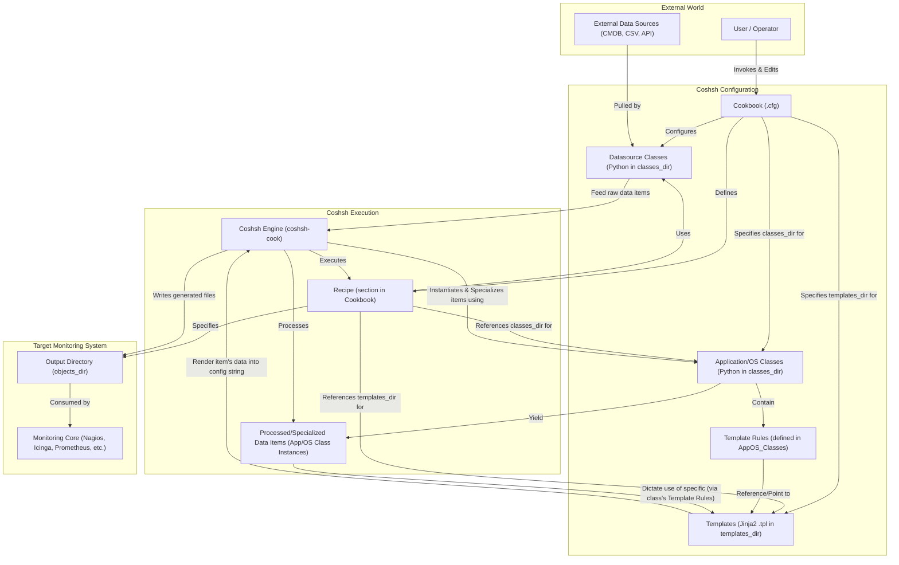

```mermaid
graph TD
    subgraph ExternalWorld["External World"]
        ExtData["External Data Sources (CMDB, CSV, API)"]
        User["User / Operator"]
    end

    subgraph CoshshConfiguration["Coshsh Configuration"]
        Cookbook["Cookbook (.cfg)"]
        DS_Classes["Datasource Classes (Python in classes_dir)"]
        AppOS_Classes["Application/OS Classes (Python in classes_dir)"]
        TRules["Template Rules (defined in AppOS_Classes)"]
        Templates["Templates (Jinja2 .tpl in templates_dir)"]
    end

    subgraph CoshshExecution["Coshsh Execution"]
        Engine["Coshsh Engine (coshsh-cook)"]
        Recipe["Recipe (section in Cookbook)"]
        ProcessedItems["Processed/Specialized Data Items (App/OS Class Instances)"]
    end

    subgraph MonitoringSystem["Target Monitoring System"]
        direction LR
        Output["Output Directory (objects_dir)"]
        MonitoringCore["Monitoring Core (Nagios, Icinga, Prometheus, etc.)"]
    end

    User -- Invokes & Edits --> Cookbook
    Cookbook -- Defines --> Recipe
    Cookbook -- Configures --> DS_Classes
    Cookbook -- "Specifies classes_dir for" --> AppOS_Classes
    Cookbook -- "Specifies templates_dir for" --> Templates

    Recipe -- Uses --> DS_Classes
    Recipe -- "References classes_dir for" --> AppOS_Classes
    Recipe -- "References templates_dir for" --> Templates
    Recipe -- Specifies --> Output

    ExtData -- Pulled by --> DS_Classes
    DS_Classes -- "Feed raw data items" --> Engine

    Engine -- Executes --> Recipe
    Engine -- "Instantiates & Specializes items using" --> AppOS_Classes
    AppOS_Classes -- "Contain" --> TRules
    AppOS_Classes -- "Yield" --> ProcessedItems

    TRules -- "Reference/Point to" --> Templates

    Engine -- "Processes" --> ProcessedItems
    ProcessedItems -- "Dictate use of specific (via class's Template Rules)" --> Templates

    Templates -- "Render item's data into config string" --> Engine
    Engine -- "Writes generated files" --> Output
    Output -- "Consumed by" --> MonitoringCore
```
