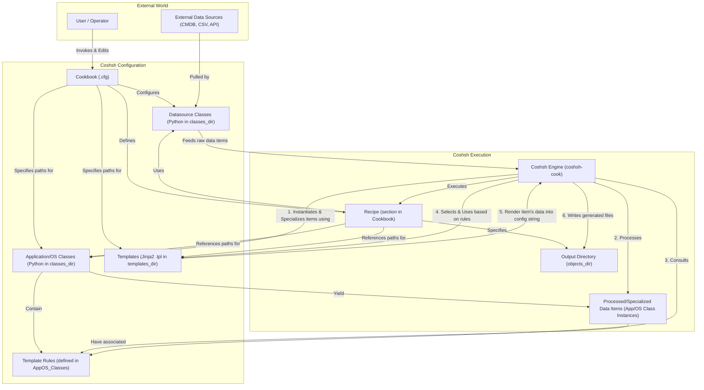

```mermaid
graph TD
    subgraph External World
        ExtData["External Data Sources (CMDB, CSV, API)"]
        User["User / Operator"]
    end

    subgraph Coshsh Configuration
        Cookbook["Cookbook (.cfg)"]
        DS_Classes["Datasource Classes (Python in classes_dir)"]
        AppOS_Classes["Application/OS Classes (Python in classes_dir)"]
        TRules["Template Rules (defined in AppOS_Classes)"]
        Templates["Templates (Jinja2 .tpl in templates_dir)"]
    end

    subgraph Coshsh Execution
        Engine["Coshsh Engine (coshsh-cook)"]
        Recipe["Recipe (section in Cookbook)"]
        ProcessedItems["Processed/Specialized Data Items (App/OS Class Instances)"]
        Output["Output Directory (objects_dir)"]
    end

    User -- Invokes & Edits --> Cookbook
    Cookbook -- Defines --> Recipe
    Cookbook -- Configures --> DS_Classes
    Cookbook -- Specifies paths for --> AppOS_Classes
    Cookbook -- Specifies paths for --> Templates

    Recipe -- Uses --> DS_Classes
    Recipe -- References paths for --> AppOS_Classes
    Recipe -- References paths for --> Templates
    Recipe -- Specifies --> Output

    ExtData -- Pulled by --> DS_Classes
    DS_Classes -- Feeds raw data items --> Engine

    Engine -- Executes --> Recipe
    Engine -- "1. Instantiates & Specializes items using" --> AppOS_Classes
    AppOS_Classes -- "Contain" --> TRules
    AppOS_Classes -- "Yield" --> ProcessedItems

    Engine -- "2. Processes" --> ProcessedItems
    ProcessedItems -- "Have associated" --> TRules
    Engine -- "3. Consults" --> TRules
    Engine -- "4. Selects & Uses based on rules" --> Templates

    Templates -- "5. Render item's data into config string" --> Engine
    Engine -- "6. Writes generated files" --> Output
```
